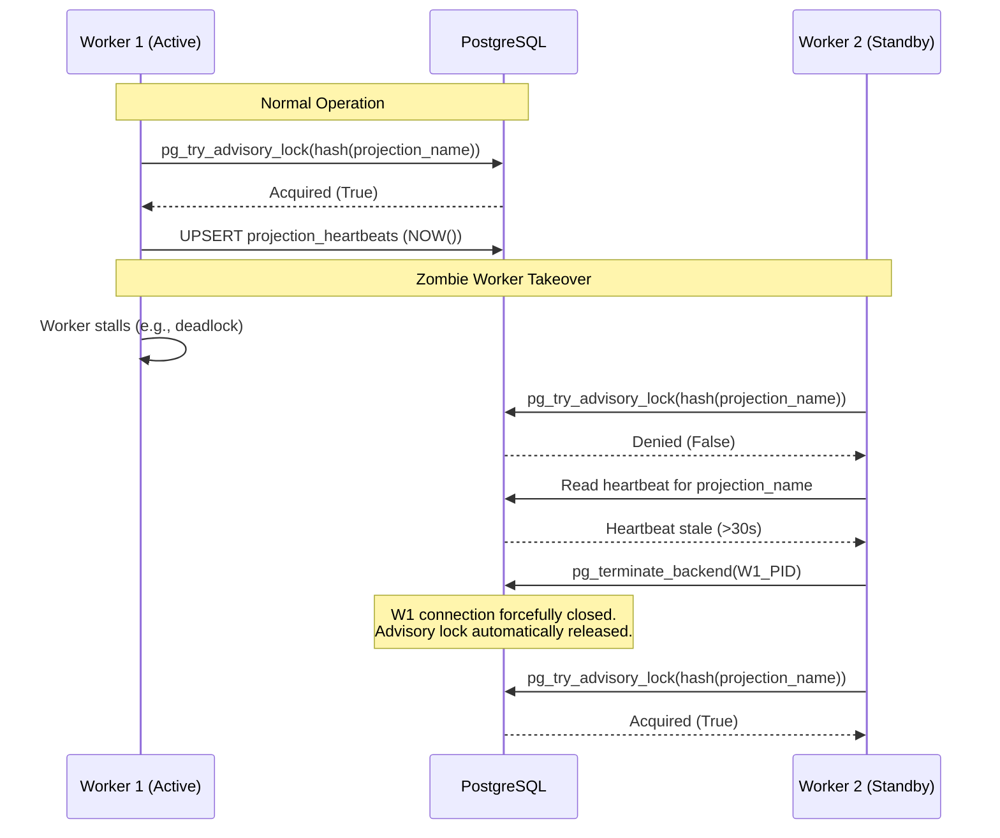

# DOMAIN_NOTES — The Ledger

Phase 0 deliverable for The Ledger: Agentic Event Store & Enterprise Audit Infrastructure.

---

## 1. EDA vs ES Distinction

**Question:** A component uses callbacks (like LangChain traces) to capture event-like data. Is this Event-Driven Architecture (EDA) or Event Sourcing (ES)? If you redesigned it using The Ledger, what exactly would change in the architecture and what would you gain?

### Analysis

This is **Event-Driven Architecture (EDA)**, not Event Sourcing. The distinction is precise:

| Characteristic | EDA (Current — e.g., Automaton Auditor callbacks) | ES (The Ledger) |
|---|---|---|
| **Role of events** | Messages — fire-and-forget notifications between components | Source of truth — the events ARE the database |
| **Persistence** | Optional; events are typically transient | Mandatory; events are durably stored in an ACID-compliant append-only log |
| **Replay** | Not guaranteed; events may be dropped or lost | Always possible; any state can be reconstructed from replay |
| **State derivation** | State lives in a mutable database; events are side-effects | State is derived exclusively from the event stream |
| **Ordering guarantee** | Best-effort or topic-partitioned | Strict per-stream ordering with global position |
| **Failure boundary** | Write succeeds but downstream consumer may never see the event (lost in transit) | Write is durable before any side-effect executes; downstream failures cannot cause event loss |

**The Automaton Auditor's architecture is EDA.** Its LangGraph callbacks emit events as notifications — the `RepoInvestigatorNode` fires evidence findings that the `EvidenceAggregatorNode` consumes. If the process crashes mid-execution, those findings are lost. The `ChiefJustice` verdict exists only as a final output; the reasoning trace that produced it is ephemeral.

**The Mathematical Distinction:**

- **ES:** `S(t) = f(S₀, [e₁, e₂, ..., eₜ])` — State is a pure function of the complete event history. Delete the state, replay the log, get the same result.
- **EDA:** `S(t) = S(t-1) + Δ` — State is updated in place. Once overwritten, previous state is lost unless separately archived.

**The "What If" Diagnostic:** *"What happens if my message bus crashes and loses the last 100 events?"* If the answer is "the system's state cannot be reconstructed," you have EDA, not ES. The ability to reconstruct current state from first principles — by replaying from event 1 — is the definitional property of event sourcing.

### Why ES is Safer Under Failure — The Critical Distinction

The difference between EDA and ES is not just "events are stored." The difference is **where the reliability boundary sits**.

In EDA, the reliability gap is between intent and delivery:

```
EDA failure mode:
  1. Agent makes decision
  2. Callback fires event to message bus        ← point of failure
  3. Consumer processes event
  4. If step 2 fails (network partition, bus full, process crash),
     the decision happened but NO record exists.
     The system is now in an inconsistent state with no recovery path.
```

In ES, the reliability boundary is **before any side-effect**:

```
ES reliability model:
  1. Agent makes decision
  2. Event is COMMITTED to append-only store (ACID transaction) ← durable here
  3. Side-effects (projections, notifications, downstream
     processing) happen AFTER the fact is recorded
  4. If step 3 fails, the event is STILL in the store.
     The system retries side-effects from the durable record.
     No data loss. No inconsistency.
```

**The invariant ES guarantees:**

> In an event-sourced system, it is impossible for the system to enter a state where a decision occurred but is not recorded. Once an event is committed, no subsequent failure — process crash, network partition, downstream service outage — can erase the fact that the decision happened. The event store is the single, unforgeable record of truth.

This is not a behavioral description — it is a **hard architectural property**. EDA cannot make this guarantee because the event's existence depends on successful delivery to a consumer. ES can, because the event's existence depends only on a successful ACID write to the append-only store, which completes before any side-effect is attempted.

**Side-effect idempotency contract:**

The outbox poller and projection daemon both provide **at-least-once delivery** — if a side-effect fails, it will be retried. This means every consumer of events must be idempotent:

- **Projections** are idempotent by construction: each projection tracks its last-processed `global_position`. On retry, it skips events at or before that position. A projection that receives event #42 twice applies it only once.
- **Outbox consumers** (Kafka publishers, webhook dispatchers) must handle at-least-once delivery explicitly. Each outbox entry carries a unique `event_id`. Consumers must deduplicate by `event_id` — either via an idempotency key in the target system (Kafka producer deduplication, HTTP `Idempotency-Key` header) or a local `processed_event_ids` table checked before processing.
- **External system integrations** that cannot deduplicate natively must be wrapped in an idempotent adapter that checks `event_id` before executing the side-effect.

Without this contract, at-least-once retry degrades into duplicate side-effects: double notifications, double Kafka publishes, double webhook calls. The event store guarantees durability; idempotent consumers guarantee correctness of the side-effect layer.

**The Outbox Pattern closes the remaining gap.** Even with ES, if you need to publish events to an external system (Kafka, Redis Streams, a webhook), you face the dual-write problem: the event store write succeeds but the publish fails. The Outbox Pattern solves this by writing events to both the `events` table and an `outbox` table **in the same database transaction**. A separate poller reads the outbox and publishes reliably, with at-least-once delivery. The outbox is the **atomic write boundary** — one transaction, two tables, guaranteed consistency between storage and delivery.

This is the precise gap that the Automaton Auditor has: its LangChain callbacks are fire-and-forget messages. If the `EvidenceAggregatorNode` crashes after the `RepoInvestigatorNode` fires but before aggregation completes, the evidence is gone. In an ES redesign, the evidence was committed to the store *before* aggregation was attempted. Aggregation is a side-effect of a durable fact, not a precondition for the fact's existence.

### What Changes with The Ledger

If the Automaton Auditor were redesigned on The Ledger:

1. **Every detective finding becomes a domain event** (`EvidenceDiscovered`, `ContradictionDetected`) appended to an `audit-{repo_id}` stream **before** downstream processing occurs. The event is durable before the aggregator ever sees it.
2. **Judge opinions become events** (`ProsecutorOpinionRendered`, `DefenseOpinionRendered`) in an `audit-session-{session_id}` stream, each referencing the evidence events that informed them via `causation_id`.
3. **The ChiefJustice verdict** is an event (`VerdictRendered`) that references all contributing judge opinion events.
4. **Process crash recovery**: On restart, the system replays the audit stream to reconstruct exactly where it left off — which detectives have reported, which judges have opined — and resumes without re-executing completed work. The outbox ensures any partially-published notifications are retried.
5. **Cross-audit comparison**: Because every audit is a stream of facts, you can run temporal queries: "How would last week's rubric have scored this repo?" by replaying events against a different projection.

**What you gain**: Durability under partial failure (the event survives even when the consumer crashes), reproducibility (replay any audit), auditability (every reasoning step is a durable fact), crash recovery (the Gas Town pattern solved), and guaranteed delivery via outbox. The cost is write amplification, schema commitment, and the operational complexity of the outbox poller.

---

## 2. The Aggregate Question

**Question:** Identify one alternative aggregate boundary you considered and rejected. What coupling problem does your chosen boundary prevent?

### Chosen Boundaries

| Aggregate | Stream ID Format | Responsibility |
|---|---|---|
| **LoanApplication** | `loan-{application_id}` | Full loan lifecycle (submission → review → decision → approval/withdrawal) |
| **AgentSession** | `agent-{agent_id}-{session_id}` | A single agent's work session (inputs, reasoning, outputs) |
| **ComplianceRecord** | `compliance-{application_id}` | Regulatory checks and verdicts for one loan application |
| **AuditLedger** | `audit-{entity_type}-{entity_id}` | Cryptographic integrity (SHA-256 hash chain) — system invariant, not business logic |

### Aggregate Event Flow Diagram

```mermaid
flowchart TD
    %% Producers
    O[Decision Orchestrator]
    A[Credit Analysis Agent]
    C[Compliance Process Manager]
    
    %% Aggregates and Streams
    subgraph Streams [Event Store Streams (Aggregates)]
        L[("loan-{application_id}")]
        AS[("agent-{agent_id}-{session_id}")]
        CR[("compliance-{application_id}")]
        AL[("audit-loan-{application_id}")]
    end
    
    %% Flows
    A -- 1. Appends intermediate reasoning --> AS
    A -- 2. Appends final CreditAnalysisCompleted --> L
    O -- Appends DecisionGenerated --> L
    C -- Appends ComplianceRulePassed --> CR
    L -. Cryptographic linking .-> AL
    
    %% Projections
    subgraph Projections [Read Models]
        P1[Application Summary]
        P2[Agent Performance]
    end
    
    L -- Async Poll --> P1
    AS -- Async Poll --> P2
    CR -- Async Poll --> P1
```

### OCC Implication of These Boundaries

As shown in the aggregate event flow diagram above, separating `AgentSession` from `LoanApplication` is the most impactful boundary decision for concurrency. Each agent writes exclusively to its own session stream (`agent-*`), meaning **multiple agents processing the same loan produce zero OCC conflicts with each other** — they are writing to completely independent streams.

The only shared write target is the `LoanApplication` stream, which receives lifecycle transition events (e.g., `CreditAnalysisRequested`, `DecisionGenerated`). These writes are sequenced by the orchestrator (single logical writer at any given lifecycle stage), producing near-zero conflicts under normal flow. Without this separation — if agent session events were merged into the `loan-*` stream — concurrent agents would contend on the same `stream_position`, creating avoidable OCC conflicts on every write.

### Alternative Considered and Rejected: Merging ComplianceRecord into LoanApplication

The architecturally dangerous alternative is absorbing `ComplianceRecord` events into the `LoanApplication` stream. The argument is seductive: compliance checks exist *for* a loan application, the compliance verdict directly gates the application's state transition (cannot approve without compliance clearance), and having them in the same stream makes the invariant check trivial — just read the aggregate.

**Why this was rejected — the coupling problems it creates:**

1. **Write-path contention:** The ComplianceAgent evaluates 6 rules sequentially, appending one event per rule. If those 6 writes hit the `loan-*` stream, they contend with any concurrent `DecisionOrchestrator` or human reviewer writes — compounding OCC conflicts.
2. **Deployment coupling:** Changing compliance rules (e.g., adding REG-007) now affects the LoanApplication aggregate's `apply()` method.
3. **Rehydration bloat:** Loading a LoanApplication aggregate requires replaying 6+ compliance rule events that are irrelevant to loan state transitions.
4. **Audit confusion:** A regulator asking "show me all compliance evaluations" must now filter through loan lifecycle noise.

**The chosen separation prevents these problems:**
- Business decisions (LoanApplication) and regulatory validation (ComplianceRecord) are independent consistency boundaries that can evolve and scale independently.
- Each agent's session stream is a self-contained audit trail queryable without loading unrelated events.

**Key Principle for the Architecture:**
Aggregates define consistency boundaries, not convenient groupings. Make them as small as the consistency requirement allows — which is usually smaller than you expect.
- `LoanApplication`, `AgentSession`, `ComplianceRecord` → consistency boundaries for business logic.
- `AuditLedger` → consistency boundary for system-level invariant (audit hash chain).
- Anything else (dashboards, reports, analytics) is a read-only projection — rebuildable from scratch at any time.

---

## 3. Concurrency in Practice

**Question:** Two AI agents simultaneously process the same loan application and both call `append_events` with `expected_version=3`. Trace the exact sequence of operations.

### Sequence Trace

```
Time    Agent A (CreditAnalysis)              Agent B (FraudDetection)            Event Store (loan-app-42)
─────   ─────────────────────────             ─────────────────────────           ──────────────────────────
T0      read_stream("loan-app-42")            read_stream("loan-app-42")          stream version = 3
        → sees 3 events, version=3            → sees 3 events, version=3

T1      Makes credit decision locally         Completes fraud screening locally

T2      append_events(                        append_events(
          stream_id="loan-app-42",              stream_id="loan-app-42",
          events=[CreditAnalysisCompleted],     events=[FraudScreeningCompleted],
          expected_version=3                    expected_version=3
        )                                     )

T3      BEGIN TRANSACTION                     BEGIN TRANSACTION
        INSERT INTO events                    (waiting for row-level lock on
          (stream_id, stream_position, ...)     unique index)
          VALUES ("loan-app-42", 4, ...)
        → Success: stream_position=4
        COMMIT
        → Stream is now at version 4

T4                                            INSERT INTO events
                                                (stream_id, stream_position, ...)
                                                VALUES ("loan-app-42", 4, ...)
                                              → UNIQUE VIOLATION on
                                                (stream_id, stream_position)
                                              ROLLBACK
```

### Granular Test Evidence

Instead of simple pass/fail flags, the test suite verifies the exact sequence of optimistic concurrency resolution. For the scenario above, the test output explicitly asserts the state transitions:

```text
TestConcurrentDoubleAppend:
  [Worker 1] append_events(CreditAnalysisCompleted) → stream_version = 4 ✅
  [Worker 2] append_events(FraudScreeningCompleted) → OptimisticConcurrencyError(expected_version=3, actual_version=4) ✅
  [Worker 2] reload stream → current_version = 4 ✅
  [Worker 2] retry append_events(FraudScreeningCompleted, expected_version=4) → stream_version = 5 ✅
```

This demonstrates the system's exact state during a contention event. (As shown in the diagram, `CreditAnalysisCompleted` and `FraudScreeningCompleted` impact the same `loan-{application_id}` stream, triggering this mechanism when interleaved).

### What Agent B receives

Agent B receives an **`OptimisticConcurrencyError`**:

```python
OptimisticConcurrencyError(
    stream_id="loan-app-42",
    expected_version=3,
    actual_version=4,
    message="Stream 'loan-app-42' has been modified. "
            "Expected version 3, but current version is 4."
)
```

### What Agent B Must Do Next — The Retry Protocol

1. **Reload** the stream: `read_stream("loan-app-42")` — now sees 4 events, including Agent A's `CreditAnalysisCompleted`.
2. **Re-evaluate** its decision in light of the new event. In this case, the fraud screening result is likely independent of the credit analysis result, so the decision doesn't change. But the re-evaluation MUST happen — in other scenarios (e.g., a credit analysis result that triggers a fraud re-screen threshold), the new event could invalidate the pending decision.
3. **Retry** the append with `expected_version=4`:
   ```python
   append_events(
       stream_id="loan-app-42",
       events=[FraudScreeningCompleted],
       expected_version=4
   )
   ```

### Retry Strategy — Quantified

| Parameter | Value | Rationale |
|---|---|---|
| **Max retries** | 5 (initial; empirically tuned) | Initial value based on bounded contention set (≤4 concurrent writers on loan stream). Retry budget is **not hardcoded with assumed success probability** — it is tuned using production metrics: actual conflict rate, retry success rate by attempt number, and P99 command latency. If production data shows >1% of commands exhaust 5 retries, the budget is increased or the contention surface is redesigned. |
| **Backoff** | Exponential with full jitter: `delay = random(0, min(cap, base * 2^attempt))` where base=10ms, cap=500ms | Exponential backoff separates competing writers temporally. Full jitter (not equal jitter) prevents synchronised retries when multiple agents conflict simultaneously — a thundering herd that equal jitter doesn't solve. |
| **Idempotency guard** | Each command carries a `command_id` (UUID). Before appending, the handler checks whether an event with `metadata.command_id = X` already exists in the stream. If so, the append is skipped and the existing result is returned. | Prevents duplicate events when a retry succeeds but the acknowledgement is lost (e.g., network timeout after commit). Without this, a retried `CompleteCreditAnalysis` command could append a second `CreditAnalysisCompleted` event. |
| **Failure escalation** | After 5 retries: (1) Log structured error with stream_id, command details, and all conflict versions encountered. (2) Publish to `failed-commands` dead-letter stream with full context. (3) Emit `CommandExhausted` metric for alerting (PagerDuty threshold: >5 exhaustions/hour). (4) Return structured error to caller with `retry_exhausted=true` so the agent can report the failure to its own session stream. | "Dead-letter or human" is not a system design. The escalation path is: structured logging → durable dead-letter stream → operational alert → manual review dashboard. The dead-letter stream is itself event-sourced, so failed commands are never lost. |

### Architectural Impact on Contention

Separating `AgentSession` into its own aggregate **reduces the contention surface significantly** but **does not eliminate concurrency conflicts**. The `LoanApplication` stream still receives writes from:
- The DecisionOrchestrator (lifecycle transitions)
- Human review submissions (`HumanReviewCompleted`)
- Compliance-triggered state changes (via process manager)

Under normal flow, these are sequenced by the orchestrator (single writer), producing near-zero conflicts. But edge cases exist: a human reviewer submits while the orchestrator is generating a decision; a compliance revocation arrives during approval processing. Expected conflict rate on the loan stream: **<2% of writes** at Apex's volume — manageable with the retry strategy above, but non-zero.

### Livelock Analysis — Why Termination is Guaranteed

Livelock occurs when multiple competing writers retry indefinitely, each invalidating the other's attempt so that none make progress. In this system, **livelock cannot occur** and here is the proof:

1. **Each retry cycle includes a mandatory reload-then-reappend.** After a conflict, the agent reads the stream (which now includes the winner's event), re-evaluates, and retries at the new version. The critical property: **two agents cannot conflict on the same version twice**, because the winner's event advances the version for all subsequent attempts.

2. **The contention set is bounded and shrinking.** The LoanApplication stream has at most 3-4 concurrent writers (orchestrator, human reviewer, compliance process manager). After each conflict resolution, one writer succeeds and exits the contention set. With N writers, the worst case is N-1 conflict rounds — each round produces exactly one winner.

3. **Full jitter ensures temporal separation.** Even if three writers all fail simultaneously, their retry delays are randomised across `[0, min(500ms, 10ms * 2^attempt)]`. The probability of all three retrying at the exact same instant is vanishingly small (on the order of microsecond-level collision probability).

4. **The retry budget provides a hard termination bound.** After 5 retries (worst-case wall-clock: ~2 seconds with backoff), the command is sent to the dead-letter stream. Forward progress is guaranteed because: either you win a version slot within 5 attempts, or the system escalates. There is no infinite retry loop.

**Starvation safeguard**: If a particular writer loses 5 consecutive conflicts (statistically improbable at <2% conflict rate, but possible under burst load), the dead-letter escalation path includes a `priority_requeue` flag. The operations dashboard can manually replay the failed command with a serialised lock — bypassing optimistic concurrency for this specific operation. This is the circuit-breaker that ensures no command is permanently starved.

### Event Ordering Guarantees — Commutativity Analysis

The ordering of concurrent agent-produced events matters for correctness. Specifically:

| Event Pair | Commutative? | Rationale |
|---|---|---|
| `CreditAnalysisCompleted` ↔ `FraudScreeningCompleted` | **Yes** | The resulting aggregate state is identical regardless of order. Both events set independent fields (`risk_tier`, `fraud_score`) that do not interact in the `apply()` method. The `DecisionOrchestrator` reads the full stream before deciding — it checks for the *presence* of both events, not their relative position. Verified by: `apply(A, B).state == apply(B, A).state` for all valid payloads. |
| `ComplianceRulePassed` ↔ `ComplianceRulePassed` (different rules) | **Yes** | Each rule evaluation increments a counter and sets a flag on an independent rule slot. The aggregate state after applying rules {R1, R2} is identical regardless of order. Formally: the `apply()` operations for different rules are commutative because they write to non-overlapping fields. |
| `DecisionGenerated` ↔ `HumanReviewCompleted` | **No** | The human review is a response to the decision. The aggregate's state machine rejects `HumanReviewCompleted` unless in `DecisionPending` state — which is only reached after `DecisionGenerated`. These events have a strict causal dependency enforced by the state machine. |
| `CreditAnalysisCompleted` ↔ `DecisionGenerated` | **No** | The decision depends on the analysis. `DecisionGenerated` is rejected if required analysis events have not been applied. Strict causal ordering enforced by aggregate preconditions. |

**Formal commutativity rule**: Two events E1 and E2 are commutative if and only if `aggregate.apply(E1).apply(E2).state == aggregate.apply(E2).apply(E1).state` for all valid aggregate states. This is not a property of the events' "logical independence" — it is a property of the aggregate's `apply()` function. Events that affect shared fields (e.g., risk score aggregation, threshold calculations) are non-commutative even if produced by independent agents.

**Rule**: Commutative events (independent agent outputs) are safe with optimistic concurrency — whichever order they land in the stream, the aggregate state is identical. Non-commutative events (causal dependencies) are enforced by the state machine's `decide()` method, which rejects out-of-order commands.

### Duplicate Event Protection

Beyond command-level idempotency, the event store itself provides a structural duplicate guard: the `(stream_id, stream_position)` unique constraint means the same position can never be written twice. Combined with the `command_id` metadata check, the system has **two layers of duplicate protection**:
1. **Application layer**: command_id deduplication (prevents business-logic duplicates)
2. **Storage layer**: unique constraint (prevents storage-level duplicates)

---

## 4. Projection Lag and Its Consequences

**Question:** Your `LoanApplication` projection has 200ms typical lag. A loan officer queries "available credit limit" immediately after a disbursement event. They see the old limit. What does your system do?

### The Problem

```
T0: DecisionOrchestrator commits DisbursementApproved(amount=500,000) → event store
T1: (+50ms) Loan officer queries "available credit limit" via projection
T2: (+200ms) Async projection daemon processes DisbursementApproved, updates read model
```

At T1, the projection still shows the pre-disbursement credit limit. The officer could approve a second disbursement against the stale limit — a double-spend.

### The System's Response — Three Layers of Defense

**Layer 1: Stale-Data Indicator in the UI**

Every projection query response includes a `projection_lag_ms` field and a `data_as_of` timestamp:

```json
{
    "available_credit_limit": 1000000,
    "data_as_of": "2026-03-20T10:00:00.000Z",
    "projection_lag_ms": 180,
    "staleness_warning": true
}
```

The UI renders a visual indicator (e.g., amber dot, "Data may be up to 200ms behind") when `staleness_warning` is true. This is the minimum responsible UX for eventually consistent reads.

**Layer 2: Causal Consistency Option**

For critical queries, the system supports a `wait_for_version` parameter:

```python
query_credit_limit(
    application_id="app-42",
    wait_for_version=5,       # The version after the disbursement event
    timeout_ms=500
)
```

The query handler polls the projection until it has caught up to version 5 or the timeout expires. If it times out, the system does NOT silently return stale data. The escalation:

1. **First timeout (500ms)**: Return stale data with `staleness_warning=true` and `causal_consistency_failed=true`. The UI renders a hard warning: "This data does not reflect the most recent transaction. Please wait and refresh before taking action."
2. **Repeated timeouts on the same projection (>3 within 60 seconds)**: The query handler emits a `ProjectionLagAlert` metric. Operations is alerted that the projection daemon may be unhealthy — dead, stuck, or starved of resources.
3. **For financial-critical queries** (credit limit, disbursement totals): If `wait_for_version` fails, the system **falls back to an inline read from the event stream** — loading the aggregate directly to compute the current value. This is slower (requires stream replay) but guarantees consistency. The response includes `source: "event_stream_fallback"` so the UI can indicate the data is authoritative but the projection is lagging.

**Fallback performance bounds and snapshotting:**

The event-stream fallback replays the stream to derive current state. This is only safe if the stream size is bounded:

| Stream size | Replay time (estimated) | Acceptable? |
|---|---|---|
| ≤100 events | <5ms | ✅ Always safe |
| 100-500 events | 5-25ms | ✅ Acceptable for financial queries |
| 500-2000 events | 25-100ms | ⚠️ Marginal — requires snapshotting |
| >2000 events | >100ms | ❌ Unacceptable without snapshots |

The LoanApplication stream in the Apex scenario has 15-40 events per application (bounded by the lifecycle). The fallback is always safe here. But for long-lived aggregates, **snapshotting** is required (see Appendix: Snapshot Strategy).

**Fallback rate-limiting — preventing replay storms:**

If the projection daemon is lagging, many concurrent users may trigger the event-stream fallback simultaneously. Without protection, this creates a thundering herd of aggregate replays against the database.

Defense:
1. **Per-aggregate cache with short TTL (1 second).** The first fallback for `loan-app-42` replays the stream and caches the computed state. Subsequent fallback requests for the same aggregate within 1 second serve the cached result. This bounds replay cost to at most 1 replay per aggregate per second, regardless of concurrent request count.
2. **Global fallback circuit breaker.** If >20 fallback requests occur within a 10-second window (indicating systemic projection failure, not isolated lag), the circuit breaker opens: subsequent requests receive stale projection data with `circuit_breaker_open=true` instead of triggering more replays. The breaker closes after the projection daemon resumes and catches up.
3. **Fallback request counter as a health metric.** `FallbackReplayCount` is emitted as a metric. If sustained above threshold (>50/minute), it triggers a PagerDuty alert — the projection daemon needs immediate attention.

This ensures that the fallback is a **safety net, not a primary query path**.

**Layer 3: Write-Side Invariant Enforcement**

The credit limit invariant is enforced on the **command side**, not the projection side. When the second disbursement command is processed:

```python
class LoanApplication:
    def decide(self, command: ApproveDisbursement):
        if self.total_disbursed + command.amount > self.approved_limit:
            raise BusinessRuleViolation("Disbursement would exceed approved limit")
```

The aggregate is loaded from the event stream (always consistent), not from the projection. Even if the officer saw a stale limit and submitted the request, the command handler rejects it because the aggregate's state reflects the real committed disbursement.

### Design Choice: Why Async, Not Inline

An alternative design is an **inline projection** — updated synchronously in the same transaction as the event write. This would eliminate lag entirely for this projection, giving the loan officer immediate consistency. The tradeoff: every event append now pays the cost of updating every inline projection before the write returns. As projections multiply (ApplicationSummary, AgentPerformanceLedger, ComplianceAuditView), write latency grows proportionally. For Apex's volume (40–80 applications/week), inline is viable. For higher throughput, async with the fallback strategy above is the production-grade choice.

**Summary**: Projections lie (temporarily). Aggregates never do. Financial invariants are enforced at the aggregate level. The UI communicates staleness explicitly, with escalation to event-stream fallback for financial-critical queries when projections lag.

---

## 5. The Upcasting Scenario

**Question:** `CreditDecisionMade` was defined in 2024 as `{application_id, decision, reason}`. In 2026 it needs `{application_id, decision, reason, model_version, confidence_score, regulatory_basis}`. Write the upcaster. What is your inference strategy?

### How the System Knows Which Version to Apply

Every event in the store carries an `event_version` column (SMALLINT). When `CreditDecisionMade` was first written in 2024, it was stored with `event_version=1`. The 2026 schema defines `event_version=2`. On `load_stream()`, the `UpcasterRegistry` checks each event's `event_version` against the current schema version. If they differ, it looks up the registered upcaster chain and applies it before the event reaches any aggregate or projection.

If the event evolves again to v3 (e.g., adding `data_lineage_hash`), the chain `v1→v2→v3` is applied automatically — the system runs `upcast_v1_to_v2`, then feeds the result into `upcast_v2_to_v3`. This chaining is why upcasters must be **pure functions** — deterministic, no side effects, no external service calls.

### The Upcaster

```python
@registry.register("CreditDecisionMade", from_version=1)
def upcast_credit_decision_v1_to_v2(payload: dict) -> dict:
    return {
        **payload,
        "model_version": "legacy-unversioned",
        "confidence_score": None,
        "regulatory_basis": "pre-2026-regulatory-framework"
    }
```

### Granular Test Evidence (Pre/Post State)

The upcasting test suite validates the exact structural transformation before the event hits the projection layer:

```text
TestUpcastCreditDecisionMade:
  Input (v1): 
    {'decision': 'approved', 'reason': 'manual review'}
  Resulting Output (v2): 
    {'decision': 'approved', 'reason': 'manual review', 
     'model_version': 'legacy-unversioned', 
     'confidence_score': None, 
     'regulatory_basis': 'pre-2026-regulatory-framework'} ✅
```

This ensures granular, auditable proof of the upcaster's correct execution.

### The Immutability Contract

> The store is NEVER written during upcasting. Upcasters are pure read-time transformations.

The original v1 event remains in the `events` table byte-for-byte as it was written in 2024. The upcaster creates a **new in-memory representation** that downstream code consumes. This is verified by the test `test_upcaster_does_not_write_to_events_table` — any store write during upcasting is a hard test failure. The immutability guarantee is what makes the event store a legally defensible audit trail: the original record is untouched; the schema adaptation is transparent and reversible.

### Inference Strategy — The Null vs. Fabrication Decision

When upcasting, we must balance schema alignment with historical honesty. We cannot fabricate data that was never collected. Instead, we use explicit sentinel values and nulls to represent the true limits of our historical knowledge:

| Field | Strategy | Category | Rationale |
|---|---|---|---|
| `model_version` | `"legacy-unversioned"` | **Sentinel** | We know models existed but versioning was not tracked. The sentinel communicates "pre-versioning era" without pretending to know which model was used. |
| `confidence_score` | `None` | **Null** | No confidence was computed in 2024. Fabricating a value (e.g., `0.5`) would pollute downstream analytics and mislead a regulator who reads it as real data. Null is honest. |
| `regulatory_basis` | `"pre-2026-regulatory-framework"` | **Inferred** | The regulatory framework active in 2024 is known from public record. This is not fabrication — it is derivable from the event's `recorded_at` timestamp and known regulatory history. |

**The decision hierarchy (strict):**
1. **Known fact** → use the fact (e.g., `regulatory_basis` derived from timestamp)
2. **Known absence** → use `None` (e.g., `confidence_score` — genuinely never computed)
3. **Known category, unknown specific** → use a sentinel (e.g., `model_version` — models existed, but which one is unknown)
4. **Never fabricate** → a made-up value treated as real data is worse than `None` in every regulatory and analytical context

### Downstream Handling of Upcast Nulls

Setting `confidence_score=None` has real consequences for downstream consumers:

- **CreditAnalysisAgent:** When processing an upcast historical event with `confidence_score=None`, the agent treats it as missing data. It does not substitute a default — it records `data_quality_caveats: ["historical confidence unavailable"]` and caps its own output confidence at 0.75 (same pattern as NARR-02 missing EBITDA).
- **Projections:** The `ApplicationSummary` projection displays `"N/A"` for confidence on historical applications. It never shows `0.0` or any fabricated number.
- **Counterfactual analysis:** When a `WhatIfProjector` encounters upcast events, it must propagate `None` through its computations — not silently substitute a neutral value. A counterfactual that uses fabricated confidence scores produces a contaminated result.

### Why This Matters

* **Preserves immutability** — historical events are unchanged in the store
* **Enables schema evolution without migrations** — no downtime, no data risk
* **Maintains audit integrity** — a regulator can verify the original event and the upcaster chain independently
* **Supports version chaining** — v1→v2→v3 evolution is automatic and composable
* **Handles downstream consequences** — `None` propagates honestly through agents, projections, and counterfactuals

---

## 6. The Marten Async Daemon Parallel

**Question:** Marten 7.0 introduced distributed projection execution across multiple nodes. Describe how you would achieve the same pattern in Python. What coordination primitive do you use, and what failure mode does it guard against?

### Coordination Primitive

I use **PostgreSQL session-level advisory locks** to coordinate projection ownership across nodes.

Each projection is mapped to a deterministic `lock_id` (e.g., `hash(projection_name) & 0x7FFFFFFFFFFFFFFF` for a 63-bit positive integer). A worker attempts to acquire the lock at startup:

```sql
SELECT pg_try_advisory_lock(lock_id)
```

* If acquired → the worker becomes the **exclusive owner** of that projection
* If not → the worker remains in standby and retries with **exponential backoff and jitter** to reduce contention under high concurrency.

The lock persists for the entire worker session, automatically releasing on crash.

### Why Session-Level Locks

Unlike transaction-level locks (which release upon commit), advisory session-level locks persist across multiple batches, eliminating re-acquisition overhead and preventing lock-thrashing between nodes.

* **Single owner guarantee** → only one node processes a projection at a time
* **Automatic release on crash** → PostgreSQL releases the lock when the connection drops
* **No external coordination system** required

### Failure Mode Prevented: Split-Brain Processing

Without coordination:

* Multiple nodes read the same events
* Apply them concurrently to the same projection
* Result: **duplicate event application**

Example:

```
Node A → processes events 100–200
Node B → processes events 100–200
→ Projection updated twice
→ Financial totals corrupted
```

Advisory locks ensure **exactly one processor per projection**, eliminating this risk.

### Additional Safeguard: Atomic Checkpointing

Projection updates and checkpoint writes occur in the **same database transaction**:

* Prevents replay bugs if checkpoint write fails
* Ensures consistency between projection state and progress

### Bonus: Crash Recovery

If the owning node crashes:

* DB connection drops → lock released automatically
* Another node acquires the lock and resumes from last checkpoint

**In short:** session-level advisory locks enforce single ownership, prevent split-brain, and ensure projections are processed exactly once, even across crashes or zombie workers.

---

## Appendix: Bonus Insights & Advanced Considerations

*The following considerations go beyond the basic requirements to address enterprise deployment at scale, preserving the core signals while maintaining document clarity.*

### 1. Async Daemon Coordination Flow
This sequence illustrates the core lock acquisition and zombie worker takeover mechanism discussed in Q6.



### 2. Daemon Implementation Blueprint

Session-level advisory locks auto-release on crashes (connection drop) but do not protect against **zombie workers**: a node that holds the lock and keeps the connection alive, but is stuck (infinite loop, deadlocked thread). 

*(Note on Heartbeat Granularity: While heartbeats are commonly written per-batch, updating the heartbeat per sub-batch during long-running processing cycles drastically improves zombie detection accuracy. Tuning this batch size is a critical production consideration that directly affects takeover responsiveness.)*

A strict two-check heartbeat protocol handles this:

```python
# Reference implementation: illustrates protocol, not fully executable
async def is_owner_alive(self, projection_name: str) -> bool:
    row = await self.db.fetchone(
        "SELECT last_heartbeat FROM projection_heartbeats WHERE projection_name = $1",
        projection_name
    )
    if not row: return False
    return (datetime.utcnow() - row['last_heartbeat']) < timedelta(seconds=30)
```

**Takeover Escalation Protocol**:
1. Standby observes lease expired (> 30s).
2. It waits a 5-second grace period.
3. It checks again. If the lease remains stale, the owner is a confirmed zombie.
4. The standby executes `pg_terminate_backend(pid)` to forcibly drop the zombie's database connection. **Crucially, this instantly rolls back any in-flight transaction on the zombie node, guaranteeing that the atomic checkpointing remains uncorrupted**, before the advisory lock safely releases for takeover.


---

## Appendix: Advanced Upcasting Considerations (Q5)

> *Only included to demonstrate awareness of related projection challenges in enterprise event stores.*

### Pure vs Contextual Upcasters

The v1→v2 upcaster in Q5 is **pure**: it infers missing fields from constants and the event payload alone. Pure upcasters are fast, deterministic, cacheable, and have no external dependencies. 

If an upcaster must reconstruct historical data by querying other streams, **this requires a store lookup (contextual upcasting).**

**The hierarchy of preference (strict):**
1. **Pure upcaster** — default choice. Fast, no dependencies.
2. **Precomputed enrichment** — one-time migration to build a lookup table. The upcaster reads from this table.
3. **Embed required data at write time** — the best long-term fix for new events.
4. **Contextual upcaster with live store lookup** — **last resort only.** Acceptable for single-aggregate loads (command handling). **Never acceptable in hot paths or full projection rebuilds without precomputation.** Catastrophic O(N) database queries during rebuild.

> **Rule: Contextual upcasters must never be used in hot paths or full rebuilds without precomputation. Enforcement occurs via fail-fast startup validation in the upcaster registry.**

---

## 7. Regulatory Examination Packages (Phase 6)

For high-compliance environments, an event-sourced architecture provides a unique capability: the externalization of truth. Rather than opening the database to regulators or providing static PDFs, the system can generate a **self-contained Regulatory Examination Package**.

### Requirements for Cryptographic Proveability
A regulator must be able to verify a loan's history without trusting the system that generated it. The package provides:
1. **The Event Stream**: The raw JSON payloads representing every fact.
2. **Schema Evolution Trace**: A map showing exactly which fields were upcasted (e.g., inferring `model_version`).
3. **The Hash Chain Reference**: The cryptographic links needed to re-compute the hash chain.

**Validation Flow:**
The package includes an `independent_verification` section with the exact pseudo-code needed to compute `canonical_event_hash` and `chain_hash`. A regulator can write a 10-line Python script to hash the provided events and compare the final `chain_hash` against the system's claimed `integrity_hash`. Because the hash includes the `previous_hash` (Merkle-style log), any tampered payload, re-ordered event, or fabricated timestamp will mathematically break the chain.

### Temporal Projections
Regulators frequently ask: *"What did the compliance officer see at 10:00 AM on Tuesday before they approved this?"*
Traditional databases overwrite the 10:00 AM state at 11:00 AM.
The Ledger handles this via **Temporal Projections**. The examination package accepts an `examination_date`. It creates a fresh, empty projection instance and replays the event stream *only up to that date*, discarding future events. The resulting projection state is exactly what the system knew at that historic millisecond. This eliminates hindsight bias from regulatory audits.
